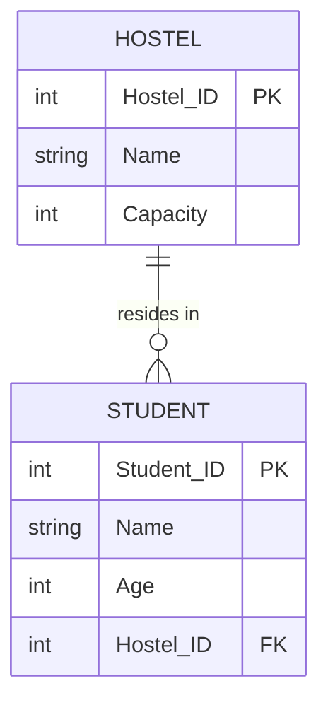
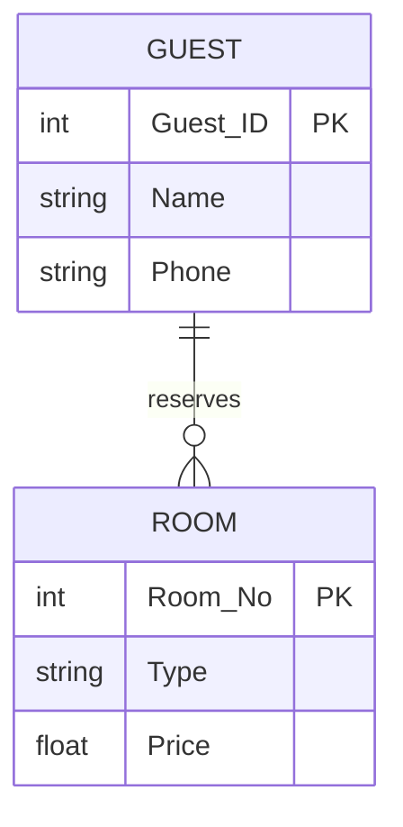
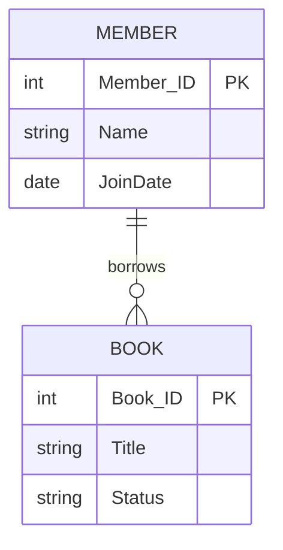

# DBMS Practical Lab Solutions (2025-26)

This document contains the MySQL queries and explanations for all 16 questions in your practical assignment.

## Getting Started in Ubuntu
Open Ubuntu terminal and type:
```bash
sudo mysql -u root -p
```
It will prompt you for your MySQL root password. After logging in, you can copy and paste the SQL commands below.

*(Note: Many questions in your assignment are identical. For example, Q3 & Q4, Q5 & Q6, Q7 & Q8, Q9 & Q10, and Q11 & Q12. They have been grouped together to save time.)*

---

## Questions 1 & 2
> **Question 1:** Develop following system. Apply necessary constraints and create tables. Assume suitable data and fields.
> Users (user_id, name, age, gender, username)
> Websites(website_id, name, type, size)
> Access(user_id, website_id, date of access, time of access)
> Store information about users of the internet as name, age, gender, username and their access to different websites with information as url, type of website as e.g. educational, entertainment etc and size of website as small or medium or large. System should store information about date of access of different websites by different users.
> Display names of users starting with letter S.
> Display number of websites in each type.
> Update age of the user “Geeta” from 20 to 21
> Display information of all male users
> Write suitable trigger.
> 
> **Question 2:** *(Same schema as above)*
> Display names of users ending with letter R.
> Create view to display all websites accessed so far.
> Update age of the user “Geeta” from 20 to 21
> Display information of all female users
> Write suitable trigger

These two questions share the same schema but ask for slightly different queries. 

### Step 1: Table Creation
```sql
CREATE DATABASE IF NOT EXISTS internet_users;
USE internet_users;

CREATE TABLE Users (
    user_id INT PRIMARY KEY,
    name VARCHAR(50),
    age INT,
    gender VARCHAR(10),
    username VARCHAR(50) UNIQUE
);

-- Note: Added 'url' to match the question's requirement.
CREATE TABLE Websites (
    website_id INT PRIMARY KEY,
    name VARCHAR(100),
    url VARCHAR(255),
    type VARCHAR(50),
    size VARCHAR(20)
);

CREATE TABLE Access (
    user_id INT,
    website_id INT,
    date_of_access DATE,
    time_of_access TIME,
    PRIMARY KEY (user_id, website_id, date_of_access),
    FOREIGN KEY (user_id) REFERENCES Users(user_id),
    FOREIGN KEY (website_id) REFERENCES Websites(website_id)
);
```

### Step 2: Queries for Question 1
```sql
-- 1. Display names of users starting with letter S.
SELECT name FROM Users WHERE name LIKE 'S%';

-- 2. Display number of websites in each type.
SELECT type, COUNT(*) AS number_of_websites FROM Websites GROUP BY type;

-- 3. Update age of the user “Geeta” from 20 to 21
UPDATE Users SET age = 21 WHERE name = 'Geeta' AND age = 20;

-- 4. Display information of all male users
SELECT * FROM Users WHERE gender = 'Male';

-- 5. Write suitable trigger. (e.g., Log when a new user is inserted)
CREATE TABLE User_Log (
    log_id INT AUTO_INCREMENT PRIMARY KEY,
    user_id INT,
    created_at TIMESTAMP DEFAULT CURRENT_TIMESTAMP
);

DELIMITER //
CREATE TRIGGER AfterUserInsert
AFTER INSERT ON Users
FOR EACH ROW
BEGIN
    INSERT INTO User_Log(user_id) VALUES (NEW.user_id);
END //
DELIMITER ;
```

### Step 3: Queries for Question 2
```sql
-- 1. Display names of users ending with letter R.
SELECT name FROM Users WHERE name LIKE '%R';

-- 2. Create view to display all websites accessed so far.
CREATE VIEW AccessedWebsites AS
SELECT DISTINCT w.name, w.url, w.type 
FROM Websites w
JOIN Access a ON w.website_id = a.website_id;

-- 3. Update age of the user “Geeta” from 20 to 21
UPDATE Users SET age = 21 WHERE name = 'Geeta' AND age = 20;

-- 4. Display information of all female users
SELECT * FROM Users WHERE gender = 'Female';

-- 5. Write suitable trigger (e.g., Prevent negative age upon insert)
DELIMITER //
CREATE TRIGGER CheckAgeBeforeInsert
BEFORE INSERT ON Users
FOR EACH ROW
BEGIN
    IF NEW.age < 0 THEN
        SIGNAL SQLSTATE '45000' SET MESSAGE_TEXT = 'Age cannot be negative';
    END IF;
END //
DELIMITER ;
```

---

## Questions 3 & 4 (Identical)
> **Questions 3 & 4:** Develop following system. Apply necessary constraints and create tables. Assume suitable data and fields.
> Bill (bill_no, date, totalamount)
> Billdetails (bill_no, itemname, price, quantity)
> Store information about bill in typical restaurant showing details as bill no, bill date, items, quantity, rate, bill amount etc.
> Display total bill amount on a particular date.
> Modify bill date in one of the bill.
> Display bill details of particular bill_no
> Create trigger for taking backup of bill information before deletion of any bill.
> Write suitable stored procedure.

### Step 1: Table Creation
```sql
CREATE DATABASE IF NOT EXISTS restaurant;
USE restaurant;

CREATE TABLE Bill (
    bill_no INT PRIMARY KEY,
    date DATE,
    totalamount DECIMAL(10, 2)
);

CREATE TABLE Billdetails (
    bill_no INT,
    itemname VARCHAR(50),
    price DECIMAL(10, 2),
    quantity INT,
    PRIMARY KEY (bill_no, itemname),
    FOREIGN KEY (bill_no) REFERENCES Bill(bill_no) ON DELETE CASCADE
);
```

### Step 2: Queries
```sql
-- 1. Display total bill amount on a particular date. (e.g. '2025-10-15')
SELECT SUM(totalamount) AS daily_total FROM Bill WHERE date = '2025-10-15';

-- 2. Modify bill date in one of the bill.
UPDATE Bill SET date = '2025-10-16' WHERE bill_no = 101;

-- 3. Display bill details of particular bill_no
SELECT * FROM Billdetails WHERE bill_no = 101;

-- 4. Create trigger for taking backup of bill information before deletion of any bill.
CREATE TABLE Bill_Backup (
    bill_no INT,
    date DATE,
    totalamount DECIMAL(10, 2),
    deleted_at TIMESTAMP DEFAULT CURRENT_TIMESTAMP
);

DELIMITER //
CREATE TRIGGER BeforeBillDelete
BEFORE DELETE ON Bill
FOR EACH ROW
BEGIN
    INSERT INTO Bill_Backup (bill_no, date, totalamount) 
    VALUES (OLD.bill_no, OLD.date, OLD.totalamount);
END //
DELIMITER ;

-- 5. Write suitable stored procedure. (e.g., Procedure to calculate total amount for a given bill based on details)
DELIMITER //
CREATE PROCEDURE CalculateTotal(IN b_no INT)
BEGIN
    UPDATE Bill 
    SET totalamount = (SELECT SUM(price * quantity) FROM Billdetails WHERE bill_no = b_no)
    WHERE bill_no = b_no;
END //
DELIMITER ;
```

---

## Questions 5 & 6 (Identical)
> **Questions 5 & 6:** Create table/tables and apply necessary constraints. Assume suitable data.
> Patient(Pid, name, gender,DOB, address, telephoneno, bloodgroup)
> Visit (Pid, dateofvisit, diagnosis, medicine, feespaid)
> Store information about patients such as patient details as name, gender, DOB, address, telephone number, blood group, diagnosis during each visit, medicine prescription given in each visit, fees paid in each visit etc.
> Alter data type of telephone no. from int to bigint
> Display number of patients of each blood group
> Display patient names and their total visits made.
> Create view to display name and address of each patient.
> Create trigger to take backup of patients

### Step 1: Table Creation
```sql
CREATE DATABASE IF NOT EXISTS hospital;
USE hospital;

CREATE TABLE Patient (
    Pid INT PRIMARY KEY,
    name VARCHAR(50),
    gender VARCHAR(10),
    DOB DATE,
    address VARCHAR(100),
    telephoneno INT,
    bloodgroup VARCHAR(5)
);

CREATE TABLE Visit (
    visit_id INT AUTO_INCREMENT PRIMARY KEY,
    Pid INT,
    dateofvisit DATE,
    diagnosis VARCHAR(100),
    medicine VARCHAR(100),
    feespaid DECIMAL(10,2),
    FOREIGN KEY (Pid) REFERENCES Patient(Pid)
);
```

### Step 2: Queries
```sql
-- 1. Alter data type of telephone no. from int to bigint
ALTER TABLE Patient MODIFY telephoneno BIGINT;

-- 2. Display number of patients of each blood group
SELECT bloodgroup, COUNT(*) AS number_of_patients FROM Patient GROUP BY bloodgroup;

-- 3. Display patient names and their total visits made.
SELECT p.name, COUNT(v.visit_id) AS total_visits
FROM Patient p
LEFT JOIN Visit v ON p.Pid = v.Pid
GROUP BY p.Pid, p.name;

-- 4. Create view to display name and address of each patient.
CREATE VIEW PatientInfo AS
SELECT name, address FROM Patient;

-- 5. Create trigger to take backup of patients
CREATE TABLE Patient_Backup (
    Pid INT,
    name VARCHAR(50),
    gender VARCHAR(10),
    DOB DATE,
    address VARCHAR(100),
    telephoneno BIGINT,
    bloodgroup VARCHAR(5),
    deleted_at TIMESTAMP DEFAULT CURRENT_TIMESTAMP
);

DELIMITER //
CREATE TRIGGER BeforePatientDelete
BEFORE DELETE ON Patient
FOR EACH ROW
BEGIN
    INSERT INTO Patient_Backup (Pid, name, gender, DOB, address, telephoneno, bloodgroup)
    VALUES (OLD.Pid, OLD.name, OLD.gender, OLD.DOB, OLD.address, OLD.telephoneno, OLD.bloodgroup);
END //
DELIMITER ;
```

---

## Questions 7 & 8 (Identical)
> **Questions 7 & 8:** For University database execute following queries:
> Department (dept_name, building, budget)
> Instructor (inst_id, name, salary, dept_name)
> Course (course_id, title, credits, dept_name)
> Teaches (course_id, inst_id)
> Find the names of all departments whose name starts with “ p ”.
> List the entire instructor relation in descending order.
> Find the names of all instructors whose salary is between 20000 and 30000
> Delete information of particular instructor
> Create view of instructor name & course for instructors in IT department.

### Step 1: Table Creation
```sql
CREATE DATABASE IF NOT EXISTS university;
USE university;

CREATE TABLE Department (
    dept_name VARCHAR(50) PRIMARY KEY,
    building VARCHAR(50),
    budget DECIMAL(15, 2)
);

CREATE TABLE Instructor (
    inst_id INT PRIMARY KEY,
    name VARCHAR(50),
    salary DECIMAL(10, 2),
    dept_name VARCHAR(50),
    FOREIGN KEY (dept_name) REFERENCES Department(dept_name)
);

CREATE TABLE Course (
    course_id VARCHAR(10) PRIMARY KEY,
    title VARCHAR(100),
    credits INT,
    dept_name VARCHAR(50),
    FOREIGN KEY (dept_name) REFERENCES Department(dept_name)
);

CREATE TABLE Teaches (
    course_id VARCHAR(10),
    inst_id INT,
    PRIMARY KEY (course_id, inst_id),
    FOREIGN KEY (course_id) REFERENCES Course(course_id),
    FOREIGN KEY (inst_id) REFERENCES Instructor(inst_id)
);
```

### Step 2: Queries
```sql
-- 1. Find the names of all departments whose name starts with “ p ”.
SELECT dept_name FROM Department WHERE dept_name LIKE 'P%';

-- 2. List the entire instructor relation in descending order.
SELECT * FROM Instructor ORDER BY name DESC;

-- 3. Find the names of all instructors whose salary is between 20000 and 30000
SELECT name FROM Instructor WHERE salary BETWEEN 20000 AND 30000;

-- 4. Delete information of particular instructor
DELETE FROM Instructor WHERE inst_id = 101;

-- 5. Create view of instructor name & course for instructors in IT department.
CREATE VIEW IT_Instructors_Courses AS
SELECT i.name, c.title
FROM Instructor i
JOIN Teaches t ON i.inst_id = t.inst_id
JOIN Course c ON t.course_id = c.course_id
WHERE i.dept_name = 'IT';
```

---

## Questions 9 & 10 (Identical)
> **Questions 9 & 10:** Create table/tables and apply necessary constraints. Assume suitable data.
> Patient(Pid, name, gender, DOB, address, telephoneno, bloodgroup)
> Visit (Pid, dateofvisit, diagnosis, medicine, feespaid)
> Store information about patients such as patient details as name, gender, DOB, address, telephone number, blood group, diagnosis during each visit, medicine prescription given in each visit, fees paid in each visit etc.
> Display details of all patients
> Add column email_id in the Patient table
> Display patient names and their total visits made.
> Display patient with age > 20 and <40.
> Create view to display name and blood group of male patients

*These use the same `hospital` database and tables as Questions 5 & 6.*

### Step 1: Queries
```sql
USE hospital;

-- 1. Display details of all patients
SELECT * FROM Patient;

-- 2. Add column email_id in the Patient table
ALTER TABLE Patient ADD email_id VARCHAR(100);

-- 3. Display patient names and their total visits made.
SELECT p.name, COUNT(v.visit_id) AS total_visits
FROM Patient p
LEFT JOIN Visit v ON p.Pid = v.Pid
GROUP BY p.Pid, p.name;

-- 4. Display patient with age > 20 and < 40.
-- Using TIMESTAMPDIFF to calculate age dynamically from DOB
SELECT * FROM Patient 
WHERE TIMESTAMPDIFF(YEAR, DOB, CURDATE()) > 20 
  AND TIMESTAMPDIFF(YEAR, DOB, CURDATE()) < 40;

-- 5. Create view to display name and blood group of male patients
CREATE VIEW MalePatientBloodGroup AS
SELECT name, bloodgroup FROM Patient WHERE gender = 'Male';
```

---

## Questions 11 & 12 (Identical)
> **Questions 11 & 12:** Create table/tables emp and dept with the following columns and apply necessary constraints. Assume suitable data.
> Emp- Emp_id, Ename, desg, qual, Salary, mob_no, Dept_id.
> Dept- Dept_id, Dname, Loc
> Find the names of all employees whose name starts with ‘Sa’.
> List all the employees name and salary whose age is less than 40 years.
> Select the employees whose salary is between Rs. 20000 and Rs. 30000.
> Display average salary of all employee
> Write a function to calculate salary

### Step 1: Table Creation
```sql
CREATE DATABASE IF NOT EXISTS company;
USE company;

CREATE TABLE Dept (
    Dept_id INT PRIMARY KEY,
    Dname VARCHAR(50),
    Loc VARCHAR(50)
);

CREATE TABLE Emp (
    Emp_id INT PRIMARY KEY,
    Ename VARCHAR(50),
    desg VARCHAR(50),
    qual VARCHAR(50),
    Salary DECIMAL(10, 2),
    mob_no VARCHAR(15),
    Dept_id INT,
    age INT, -- Age added as it is required for Query 2
    FOREIGN KEY (Dept_id) REFERENCES Dept(Dept_id)
);
```

### Step 2: Queries
```sql
-- 1. Find the names of all employees whose name starts with ‘Sa’.
SELECT Ename FROM Emp WHERE Ename LIKE 'Sa%';

-- 2. List all the employees name and salary whose age is less than 40 years.
SELECT Ename, Salary FROM Emp WHERE age < 40;

-- 3. Select the employees whose salary is between Rs. 20000 and Rs. 30000.
SELECT * FROM Emp WHERE Salary BETWEEN 20000 AND 30000;

-- 4. Display average salary of all employee
SELECT AVG(Salary) AS Average_Salary FROM Emp;

-- 5. Write a function to calculate salary (e.g., Annual Salary calculation)
DELIMITER //
CREATE FUNCTION CalculateAnnualSalary(emp_salary DECIMAL(10,2)) 
RETURNS DECIMAL(10,2)
DETERMINISTIC
BEGIN
    RETURN emp_salary * 12;
END //
DELIMITER ;
-- Usage Example: SELECT Ename, CalculateAnnualSalary(Salary) FROM Emp;
```

---

## ER Diagram to Table Conversions (Questions 13 - 16)

For these, you are asked to draw an ER diagram, convert it to tables, and create at least 2 tables with constraints in SQL.

### Question 13: Book Shop Management System
> **Question 13:** Draw an ER diagram for Book shop management system convert it into tables and Create atleast 2 tables in SQL with required constraints
**ER Conceptualization:** 
- **Entities:** `Author` (Author_ID, Name), `Book` (Book_ID, Title, Price)
- **Relationship:** `Writes` (1 to Many from Author to Book)


**SQL Representation:**
```sql
CREATE DATABASE IF NOT EXISTS book_shop;
USE book_shop;

CREATE TABLE Authors (
    Author_ID INT PRIMARY KEY,
    Name VARCHAR(100) NOT NULL
);

CREATE TABLE Books (
    Book_ID INT PRIMARY KEY,
    Title VARCHAR(100) NOT NULL,
    Price DECIMAL(10, 2) CHECK (Price > 0),
    Author_ID INT,
    FOREIGN KEY (Author_ID) REFERENCES Authors(Author_ID)
);
```

### Question 14: Hostel Management System
> **Question 14:** Draw an ER diagram for Hostel management system convert it into tables and Create atleast 2 tables in SQL with required constraints
**ER Conceptualization:**
- **Entities:** `Hostel` (Hostel_ID, Name, Capacity), `Student` (Student_ID, Name, Age)
- **Relationship:** `Resides_In` (1 to Many from Hostel to Student)



**SQL Representation:**
```sql
CREATE DATABASE IF NOT EXISTS hostel_mgmt;
USE hostel_mgmt;

CREATE TABLE Hostels (
    Hostel_ID INT PRIMARY KEY,
    Name VARCHAR(100) NOT NULL,
    Capacity INT CHECK (Capacity > 0)
);

CREATE TABLE Students (
    Student_ID INT PRIMARY KEY,
    Name VARCHAR(100) NOT NULL,
    Age INT,
    Hostel_ID INT,
    FOREIGN KEY (Hostel_ID) REFERENCES Hostels(Hostel_ID)
);
```

### Question 15: Hotel Management System
> **Question 15:** Draw an ER diagram for Hotel management system convert it into tables and Create atleast 2 tables in SQL with required constraints
**ER Conceptualization:**
- **Entities:** `Guest` (Guest_ID, Name, Phone), `Room` (Room_No, Type, Price)
- **Relationship:** `Reserves` (Many to Many / 1 to Many depending on design; assuming simple Reservation here).



**SQL Representation:**
```sql
CREATE DATABASE IF NOT EXISTS hotel_mgmt;
USE hotel_mgmt;

CREATE TABLE Guests (
    Guest_ID INT PRIMARY KEY,
    Name VARCHAR(100) NOT NULL,
    Phone VARCHAR(15) UNIQUE
);

CREATE TABLE Rooms (
    Room_No INT PRIMARY KEY,
    Type VARCHAR(50),
    Price DECIMAL(10,2) CHECK (Price > 0)
);
```

### Question 16: Library Management System
> **Question 16:** Draw an ER diagram for Library management system convert it into tables and Create atleast 2 tables in SQL with required constraints
**ER Conceptualization:**
- **Entities:** `Member` (Member_ID, Name, JoinDate), `Book` (Book_ID, Title, Status)
- **Relationship:** `Borrows` (Members can borrow Books)



**SQL Representation:**
```sql
CREATE DATABASE IF NOT EXISTS library_mgmt;
USE library_mgmt;

CREATE TABLE Members (
    Member_ID INT PRIMARY KEY,
    Name VARCHAR(100) NOT NULL,
    JoinDate DATE
);

CREATE TABLE Books (
    Book_ID INT PRIMARY KEY,
    Title VARCHAR(100) NOT NULL,
    Status VARCHAR(20) DEFAULT 'Available'
);
```
